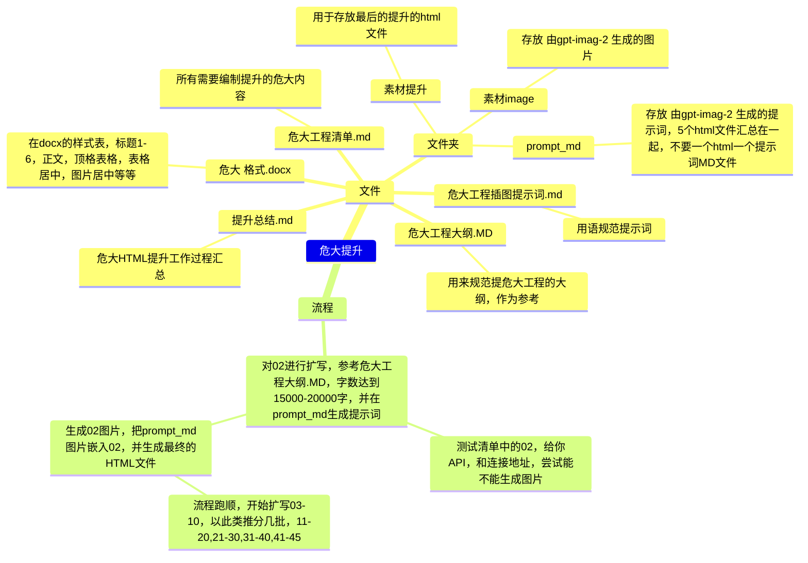

# 1234

```mermaid
mindmap
  危大提升
    文件
      危大工程大纲.MD
        用来规范提危大工程的大纲，作为参考
      提升总结.md
        危大HTML提升工作过程汇总
      危大工程插图提示词.md
        用语规范提示词
      危大工程清单.md
        所有需要编制提升的危大内容
      危大 格式.docx
        在docx的样式表，标题1-6，正文，顶格表格，表格居中，图片居中等等
      文件夹
        素材提升
          用于存放最后的提升的html文件
        prompt_md
          存放 由gpt-imag-2 生成的提示词，5个html文件汇总在一起，不要一个html一个提示词MD文件
        素材image
          存放 由gpt-imag-2 生成的图片
    流程
      对02进行扩写，参考危大工程大纲.MD，字数达到15000-20000字，并在prompt_md生成提示词
        测试清单中的02，给你API，和连接地址，尝试能不能生成图片
        生成02图片，把prompt_md图片嵌入02，并生成最终的HTML文件
          流程跑顺，开始扩写03-10，以此类推分几批，11-20,21-30,31-40,41-45

```
