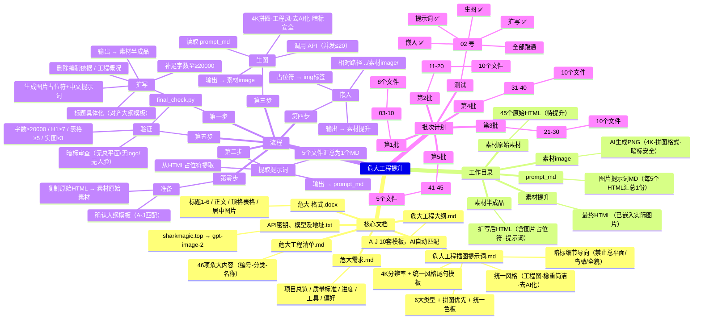

# 危大提升2

```mermaid
mindmap
  危大工程提升
    核心文档
      危大需求.md
        项目总览 / 质量标准 / 进度 / 工具 / 偏好
      危大工程大纲.md
        A-J 10套模板，AI自动匹配
      危大工程插图提示词.md
        统一风格（工程图·稳重简洁·去AI化）
        暗标细节导向（禁止总平面/鸟瞰/全貌）
        6大类型 + 拼图优先 + 统一色板
        4K分辨率 + 统一风格尾句模板
      危大工程清单.md
        46项危大内容（编号-分类-名称）
      危大 格式.docx
        标题1-6 / 正文 / 顶格表格 / 居中图片
      API密钥、模型及地址.txt
        sharkmagic.top → gpt-image-2
    工作目录
      素材原始素材
        45个原始HTML（待提升）
      素材半成品
        扩写后HTML（含图片占位符+提示词）
      素材提升
        最终HTML（已嵌入实际图片）
      prompt_md
        图片提示词MD（每5个HTML汇总1份）
      素材image
        AI生成PNG（4K·拼图格式·暗标安全）
    流程
      第零步
        准备
          复制原始HTML → 素材原始素材
          确认大纲模板（A-J匹配）
      第一步
        扩写
          删除编制依据 / 工程概况
          标题具体化（对齐大纲模板）
          补足字数至≥20000
          生成图片占位符+中文提示词
          输出 → 素材半成品
      第二步
        提取提示词
          从HTML占位符提取
          5个文件汇总为1个MD
          输出 → prompt_md
      第三步
        生图
          读取 prompt_md
          调用 API（并发≤20）
          4K拼图·工程风·去AI化·暗标安全
          输出 → 素材image
      第四步
        嵌入
          占位符 → img标签
          相对路径 ../素材image/
          输出 → 素材提升
      第五步
        验证
          final_check.py
          字数≥20000 / H1≥7 / 表格≥5 / 实图≥3
          暗标审查（无总平面/无logo/无人脸）
    批次计划
      测试
        02 号
          扩写 ✅
          提示词 ✅
          生图 ✅
          嵌入 ✅
          全部跑通
      第1批
        03-10
          8个文件
      第2批
        11-20
          10个文件
      第3批
        21-30
          10个文件
      第4批
        31-40
          10个文件
      第5批
        41-45
          5个文件

```
