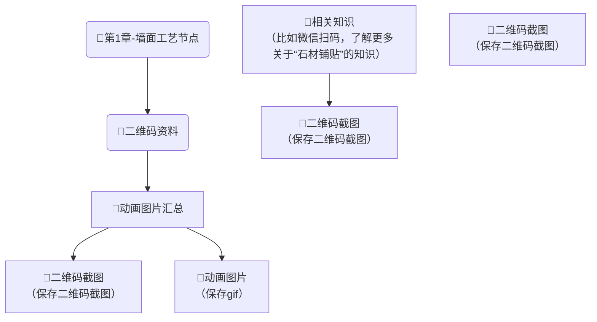

# 未命名

```mermaid
flowchart TD
  n_0("📂第1章-墙面工艺节点")
  n_1("📂二维码资料")
  n_2["📂二维码截图<br/>（保存二维码截图）"]
  n_3["📂动画图片汇总"]
  n_4["📂动画图片 <br/>（保存gif）"]
  n_5["📂相关知识<br/>（比如微信扫码，了解更多关于“石材铺贴”的知识）"]
  n_6["📂二维码截图<br/>（保存二维码截图）"]
  n_7["📂二维码截图<br/>（保存二维码截图）"]
  n_0 --> n_1
  n_1 --> n_3
  n_3 --> n_2
  n_3 --> n_4
  n_5 --> n_6

```
