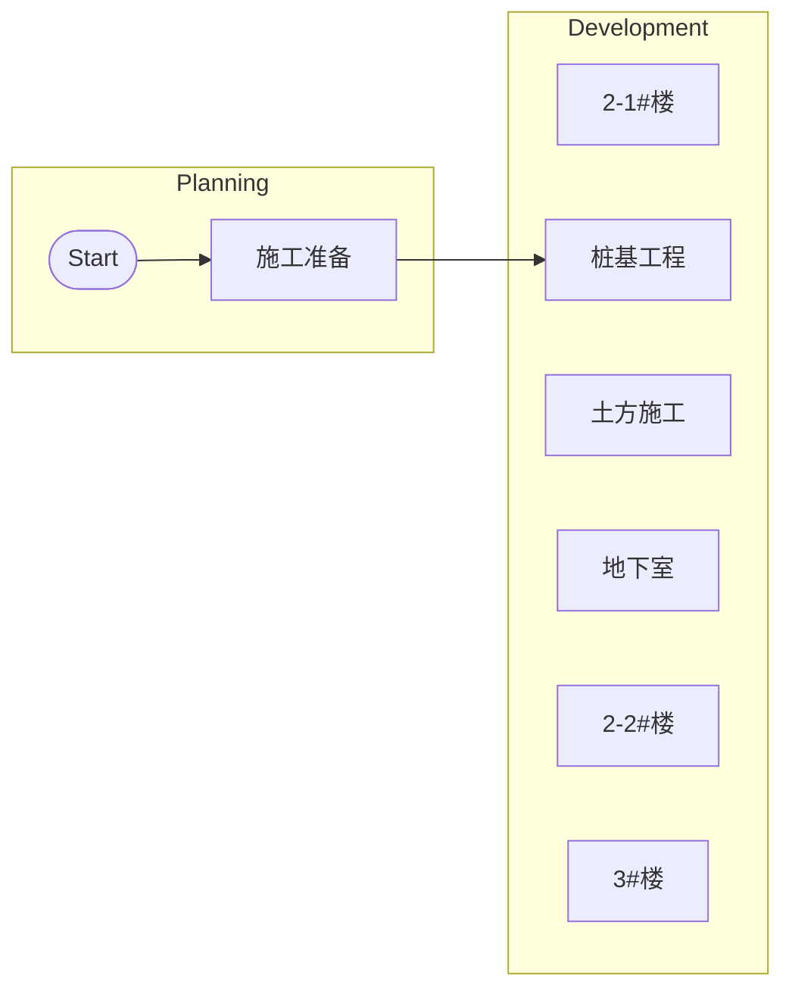

# 未命名

```mermaid
flowchart LR
  subgraph lane_0["Planning"]
    t_0(["Start"])
    t_1["施工准备"]
  end
  subgraph lane_1["Development"]
    t_2["2-1#楼"]
    t_3["桩基工程"]
    t_4["土方施工"]
    t_5["地下室"]
    t_6["2-2#楼"]
    t_7["3#楼"]
  end
  t_0 --> t_1
  t_1 --> t_3

```
