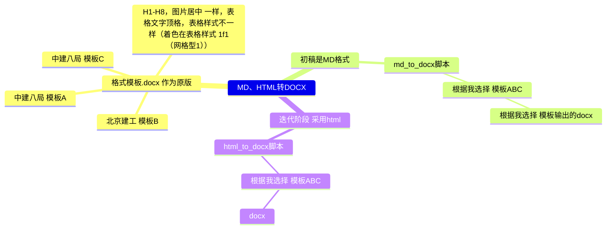

# 未命名

```mermaid
mindmap
  MD、HTML转DOCX
    格式模板.docx 作为原版
      中建八局 模板A
      北京建工 模板B
      中建八局 模板C
      H1-H8，图片居中 一样，表格文字顶格，表格样式不一样（着色在表格样式 1f1（网格型1））
    初稿是MD格式
      md_to_docx脚本
        根据我选择 模板ABC
          根据我选择 模板输出的docx
    迭代阶段 采用html
      html_to_docx脚本
        根据我选择 模板ABC
          docx

```
