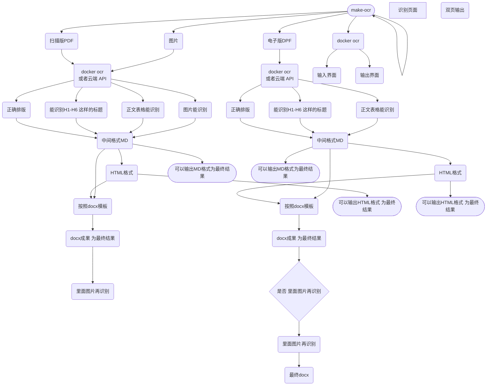

# 未命名

```mermaid
flowchart TD
  n_0(["make-ocr"])
  n_1("扫描版PDF")
  n_2("电子版DPF")
  n_3("docker ocr<br/>或者云端 API")
  n_4("图片")
  n_5("能识别H1-H6 这样的标题")
  n_6("正文表格能识别")
  n_7("图片能识别")
  n_8("按照docx模板")
  n_9("里面图片再识别")
  n_10("docx成果 为最终结果")
  n_11("中间格式MD")
  n_12("HTML格式")
  n_13("docker ocr<br/>或者云端 API")
  n_14("能识别H1-H6 这样的标题")
  n_15("正文表格能识别")
  n_16("按照docx模板")
  n_17("docx成果 为最终结果")
  n_18("中间格式MD")
  n_19("HTML格式")
  n_20("最终docx")
  n_21("里面图片再识别")
  n_22{"是否 里面图片再识别"}
  n_23("正确排版")
  n_24("正确排版")
  n_25(["可以输出MD格式为最终结果"])
  n_26(["可以输出MD格式为最终结果"])
  n_27(["可以输出HTML格式 为最终结果"])
  n_28(["可以输出HTML格式 为最终结果"])
  n_29("docker ocr")
  n_30("输入界面")
  n_31("输出界面")
  n_32["识别页面<br/>"]
  n_33("双页输出")
  n_0 --> n_0
  n_0 --> n_1
  n_0 --> n_2
  n_0 --> n_4
  n_11 --> n_8
  n_11 --> n_12
  n_12 --> n_8
  n_8 --> n_10
  n_10 --> n_9
  n_18 --> n_16
  n_18 --> n_19
  n_19 --> n_16
  n_16 --> n_17
  n_4 --> n_3
  n_1 --> n_3
  n_2 --> n_13
  n_13 --> n_14
  n_13 --> n_15
  n_15 --> n_18
  n_14 --> n_18
  n_7 --> n_11
  n_6 --> n_11
  n_5 --> n_11
  n_3 --> n_6
  n_21 --> n_20
  n_17 --> n_22
  n_22 --> n_21
  n_3 --> n_5
  n_3 --> n_7
  n_3 --> n_23
  n_23 --> n_11
  n_13 --> n_24
  n_24 --> n_18
  n_11 --> n_25
  n_18 --> n_26
  n_12 --> n_27
  n_19 --> n_28
  n_0 --> n_29
  n_29 --> n_30
  n_29 --> n_31

```
