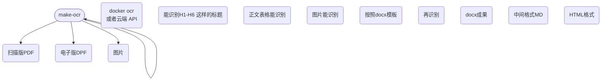

# 未命名

```mermaid
flowchart TD
  n_0(["make-ocr"])
  n_1("扫描版PDF")
  n_2("电子版DPF")
  n_3("docker ocr<br/>或者云端 API")
  n_4("图片")
  n_5("能识别H1-H6 这样的标题")
  n_6("正文表格能识别")
  n_7("图片能识别")
  n_8("按照docx模板")
  n_9("再识别")
  n_10("docx成果")
  n_11("中间格式MD")
  n_12("HTML格式")
  n_0 --> n_0
  n_0 --> n_1
  n_0 --> n_2
  n_0 --> n_4

```
