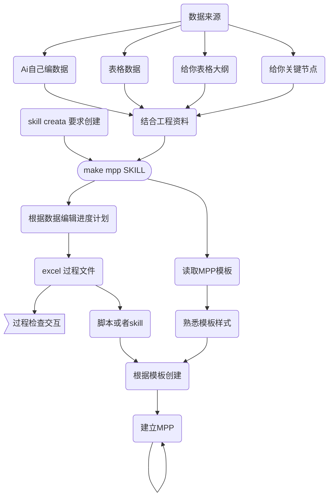

# 进度MMP skill (local)

```mermaid
flowchart TD
  n_0(["make mpp SKILL"])
  n_1("数据来源")
  n_2("skill  creata 要求创建")
  n_3("Ai自己编数据")
  n_4("表格数据")
  n_5("建立MPP")
  n_6("给你表格大纲")
  n_7("给你关键节点")
  n_8("结合工程资料")
  n_9("excel 过程文件")
  n_10("根据数据编辑进度计划")
  n_11>"过程检查交互"]
  n_12("脚本或者skill")
  n_13("读取MPP模板")
  n_14("根据模板创建")
  n_15("熟悉模板样式")
  n_2 --> n_0
  n_1 --> n_3
  n_1 --> n_4
  n_1 --> n_6
  n_1 --> n_7
  n_3 --> n_8
  n_4 --> n_8
  n_6 --> n_8
  n_7 --> n_8
  n_8 --> n_0
  n_0 --> n_10
  n_10 --> n_9
  n_9 --> n_11
  n_0 --> n_13
  n_12 --> n_14
  n_14 --> n_5
  n_5 --> n_5
  n_13 --> n_15
  n_9 --> n_12
  n_15 --> n_14

```
