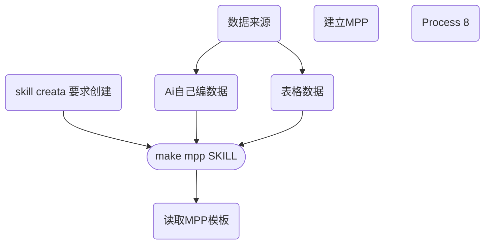

# 进度MMP skill (local)

```mermaid
flowchart TD
  n_0(["make mpp SKILL"])
  n_1("数据来源")
  n_2("skill  creata 要求创建")
  n_3("Ai自己编数据")
  n_4("表格数据")
  n_5("建立MPP")
  n_6("读取MPP模板")
  n_7("Process 8")
  n_1 --> n_3
  n_1 --> n_4
  n_2 --> n_0
  n_3 --> n_0
  n_4 --> n_0
  n_0 --> n_6

```
